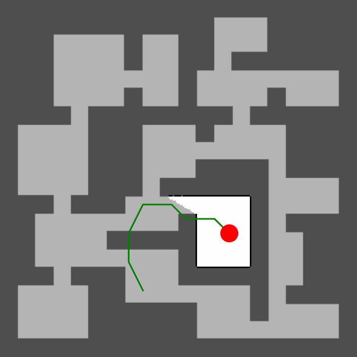
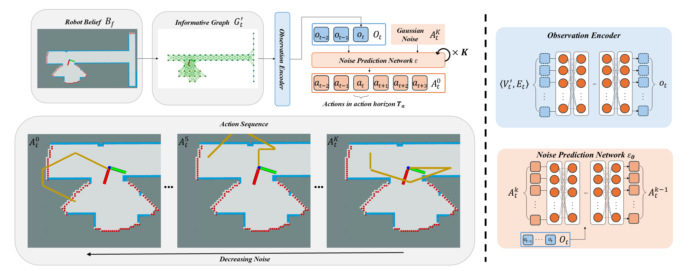

<h1 align="center"> DARE: Diffusion Policy to Autonomous Robotics Exploration </h1>

<div align="center">

[](https://ieeexplore.ieee.org/abstract/document/11128196)
[](https://arxiv.org/abs/2410.16687)
[](https://ubuntu.com/blog/tag/22-04-lts)
[]()



</div>

---

## Introduction
Autonomous robot exploration requires efficient path planning to map unknown environments. While conventional methods are often limited to optimizing based on current beliefs, **DARE (Diffusion Policy for Autonomous Robot Exploration)** leverages the power of generative AI to reason about unknown areas by drawing on learned experiences.

DARE is a novel approach that utilizes **diffusion models** trained on expert demonstrations to explicitly generate long-horizon exploration paths. By combining an attention-based encoder with a diffusion policy, DARE learns to recognize potential structures in unknown regions from partial beliefs, enabling it to plan paths that consider these unobserved areas.

**Key Features:**
*   **Generative Path Planning:** Uses diffusion models to explicitly generate efficient exploration paths.
*   **Expert Demonstrations:** Trained on ground truth optimal demonstrations to learn superior exploration patterns.
*   **Structure Reasoning:** Capable of reasoning about potential structures in unknown areas based on partial beliefs.
*   **Robust Performance:** Achieves state-of-the-art performance with strong generalizability in both simulation and real-world scenarios.

<div align="center">

</div>

---

## Usage
### Requirements
Install the following dependencies in a conda environment as shown below:
```bash
git clone https://github.com/marmotlab/DARE.git && cd DARE
conda create -n env_dare python=3.12.9 -y
conda activate env_dare
pip install -e .
```


### Dataset Collection
Modify `dataset_parameter.py` to fit your dataset needs then run dataset collection script:
```bash
python dataset_driver.py
```

Dataset will be saved to directory `diffusion_exploration/dataset/name_of_test`.
It will include a `data.zarr` directory which contains the dataset and a `gifs` directory.

### Policy Training
Copy desired training config file from `diffusion_exploration/diffusion_policy/config`.
Modify desired task config file from `diffusion_exploration/diffusion_policy/config/task`.

**Note:** You probably should modify the `zarr_path` to change dataset location

You can run the training script which requires two arguements:
1. `--config-dir` which is the directory to find the config file
2. `--config-name` which is the name of the config file

```bash
python train.py --config-dir=. --config-name=train_exploration_transformer_node_discrete.yaml
```

This will create a directory `diffusion_exploration/data/date/time/name_of_run`

### Evaluation
Modify `test_parameter.py` to fit your test needs then run evaluation script:
```bash
python test_driver.py
```

Test results will be printed on terminal and saved as a CSV
`inference_gifs` directory will be created in `diffusion_exploration/data/date/time/name_of_run`.

---

## Class Project: K-sampling trajectory re-ranking:

Metrics from the infromative graph:

1. Utility sum along implied node path: total utility collected by the nodes visited by the predicted path.
2. Unique-node count: how many distinct graph nodes the predicted path visits.
3. Revisit penalty: how often the predicted path returns to nodes it already visited.
4. Invalid-edge count: how many predicted transitions are not valid graph edges.
5. Terminal-node utility: utility of the last implied node in the predicted path.
6. Terminal-node degree / connectivity: number of valid neighboring next nodes from the last implied node.
7. Guidepost overlap / alignment: how much the predicted path follows guidepost-marked nodes.

These are used to calculate a score based on k-sampled trajectories from the diffusion model. Each metric has a coefficient which is tuned using Optuna Tree-structured Parzen Estimator algorithm (TPESampler). As well, the number of samples k is tuned. 

The current implimentation runs this on the already trained model, trying to improve just inference. To run this:

```bash
python k_sampling_reranking_driver.py
```

where the number of test trials can be set in this function. The results from the optuna optimization are printed and saved into a file in the folder `/optune`.